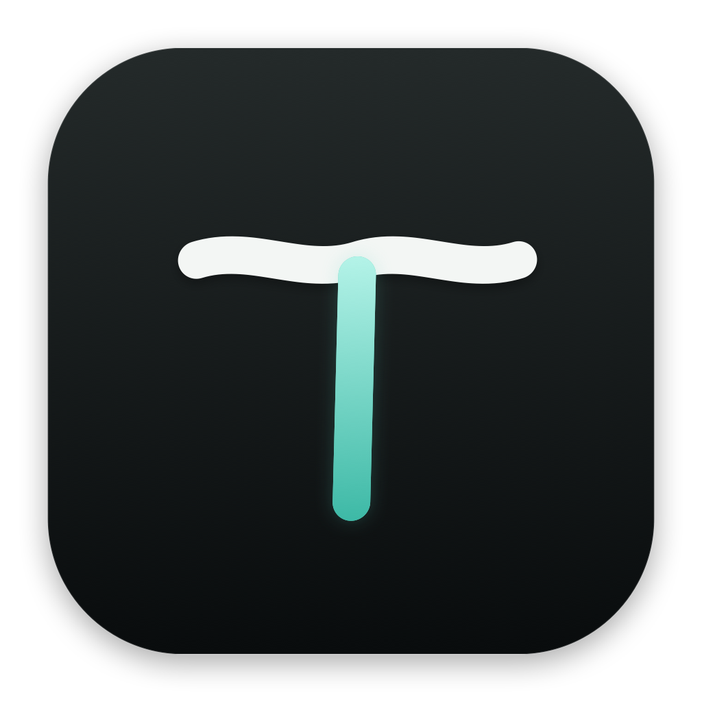
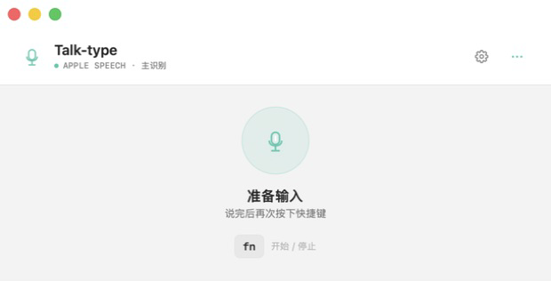
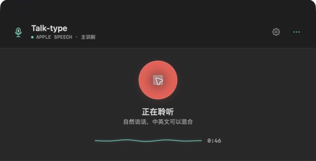
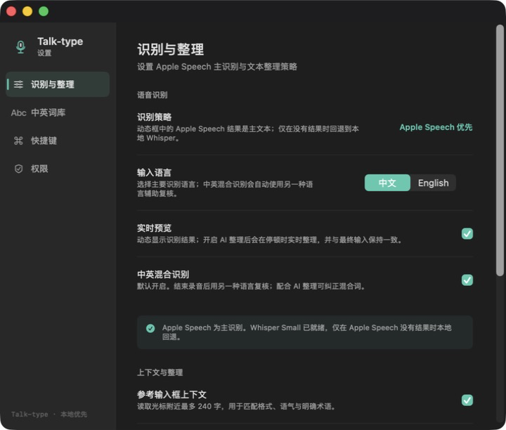
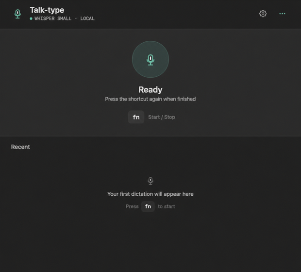
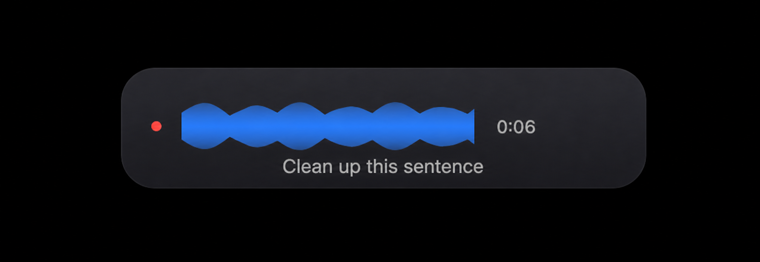
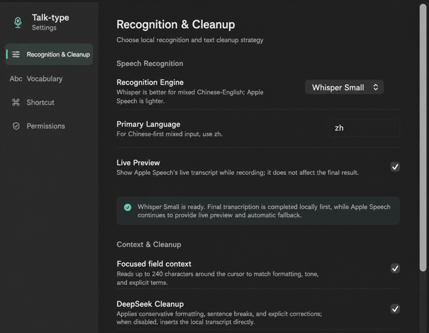

<div align="center">



# Talk-type

**AI voice input for macOS**

Say it naturally. Talk-type recognizes, lightly cleans up, and inserts your words where the cursor is.


[开始了解](#overview) · [Get started](#overview-en)

</div>

<a id="overview"></a>

## 开始了解

### 语音输入，专注表达

Talk-type 是一款原生 macOS AI 语音输入工具。按下 `fn` 或自定义全局快捷键，开始说话；结束时再次触发，文字就会整理并插入当前光标位置。

它为中文和中英混合输入而设计，适合写作、编程、记笔记、回复消息，以及任何可以输入文字的 macOS 应用。Talk-type 将快速语音识别、保守的文本整理和跨应用自动输入连接为一条完整流程：

- Apple Speech 在录音时提供实时预览，让识别结果即时可见。
- 当 Apple Speech 没有得到有效结果时，可选的本地 Whisper Small 会作为回退识别。
- 句子、长文本和需要结合光标位置的内容，可交给选定的 AI 做标点、断句、格式匹配和明确的识别错误修正。
- 整理后的文字会自动写入当前应用；未授予辅助功能权限时，结果仍会保留在剪贴板中，方便手动粘贴。

Talk-type 的原则是保留原意。AI 只负责整理语音转写文字，不回答问题、不执行语音中的命令，也不会把一句输入扩写成另一段内容。

### 使用界面

<p align="center">
  
</p>
<p align="center"><sub>主窗口：一键开始语音输入，查看当前状态和最近记录。</sub></p>

<p align="center">
  
</p>
<p align="center"><sub>录音悬浮条：显示音量波形、计时和实时识别结果，不打断当前工作。</sub></p>

<p align="center">
  
</p>
<p align="center"><sub>设置页：配置识别语言、词库、AI 文本整理、快捷键和系统权限。</sub></p>

### 从说话到落字

1. **开始录音**：按下 `fn` 或设置好的全局快捷键。
2. **实时预览**：Apple Speech 持续返回中间结果，主窗口和悬浮条同步显示文字与音量波形。
3. **确认转写**：结束录音后，优先使用已经看到的 Apple Speech 结果；只有结果为空时才尝试本地 Whisper Small。
4. **可选整理**：对于句子、长文本或光标右侧已有内容的句中插入，使用当前选择的 AI 进行保守整理。独立词和专有名词可直接输入，减少不必要的网络请求。
5. **插入结果**：根据光标上下文调整必要的句末标点和空格，然后自动粘贴到当前应用，并保留最近结果供复制。

### 核心能力

- **中文与中英混合识别**：支持英文名称、产品名、技术词汇和个人专有名词词库。
- **实时语音预览**：录音过程中显示识别文本、录音时长和动态波形。
- **本地 Whisper 回退**：Apple Speech 没有结果时，可使用本机安装的 `whisper-cli` 和 Whisper Small 模型完成识别。
- **多 AI 供应商**：支持 DeepSeek、Anthropic（Claude）、OpenAI、xAI（Grok）、Qwen（通义千问）和 Kimi（月之暗面）。
- **保守文本整理**：优化标点、断句、空格、大小写和明确的同音或专名错误，不自由改写内容。
- **光标上下文匹配**：读取光标附近有限范围的文字，用于判断列表格式、段落风格、标点和句中补词。
- **跨应用自动输入**：通过 macOS 辅助功能把结果写入当前输入框；无法自动输入时自动放入剪贴板。
- **全局快捷键与菜单栏**：支持 `fn` 和自定义组合键，主窗口、菜单栏和录音悬浮条均可操作。
- **最近记录**：在本机保存最近的输入结果，可复制单条记录，也可以一键清空。

### AI 文本整理

在「设置 → 识别与整理 → AI 文本整理」中选择供应商并填写 API Key。每个供应商的 API Key 和模型 ID 独立保存，切换供应商不会覆盖其他配置。

| 供应商 | 默认模型 | 接口形式 |
| --- | --- | --- |
| DeepSeek | `deepseek-chat` | Chat Completions |
| Anthropic / Claude | `claude-sonnet-5` | Anthropic Messages |
| OpenAI | `gpt-5.6-luna` | Chat Completions |
| xAI / Grok | `grok-4.5` | Chat Completions |
| Qwen / 通义千问 | `qwen-plus` | OpenAI 兼容 Chat Completions |
| Kimi / Moonshot | `kimi-k3` | Chat Completions |

默认模型只是方便开始使用的示例。可以在设置中直接填写账号实际可用的模型 ID；模型可用性、价格和区域支持以相应服务的当前文档为准。

### 隐私与数据流

- 麦克风音频只用于本次录音和本地转写流程，临时音频文件会在处理结束后删除。
- AI 文本整理默认可关闭；开启后只发送识别出的文字和可选的光标上下文，不发送原始音频。
- 光标上下文最多读取有限字符，并且不会作为历史记录持久保存；安全输入框不会读取上下文。
- API Key 保存在 macOS 钥匙串中，并按供应商分别存储。
- 最近输入记录保存在本机，可在应用中随时删除或清空。
- 语音中的问题、命令、代码和引用会被当作需要输入的文本处理，不会被 AI 执行。

### 开始前

Talk-type 至少需要：

- macOS 14 或更高版本。
- 麦克风权限，用于录音。
- 语音识别权限，用于 Apple Speech 实时预览和最终回退识别。
- 辅助功能权限，用于读取可选的光标上下文和自动插入文字。
- AI 文本整理不是必需项；不填写 API Key 时，仍可使用本地语音识别和直接输入。

首次打开后，建议按以下顺序配置：

1. 在「设置 → 权限」中开启麦克风、语音识别和辅助功能权限。
2. 在「设置 → 识别与整理」中选择主要语言；中文混合输入建议使用 `zh`。
3. 在「设置 → 中英词库」中添加常用产品名、技术词和专有名词。
4. 如需 AI 整理，选择供应商，填写对应 API Key，并确认模型 ID。
5. 直接按 `fn` 开始和结束一次语音输入；也可以在「快捷键」中改成自定义组合键。

<details>
<summary><strong>安装本地 Whisper Small（可选）</strong></summary>

Talk-type 会在以下位置查找可执行文件 `whisper-cli`：

```text
/opt/homebrew/bin/whisper-cli
/usr/local/bin/whisper-cli
```

模型文件名应为 `ggml-small.bin`，推荐放在：

```text
~/Library/Application Support/Talk-type/Models/ggml-small.bin
```

旧版本使用过的路径仍然兼容：

```text
~/Library/Application Support/Murmur/Models/ggml-small.bin
```

Whisper Small 模型约 465 MB。没有安装模型时，Talk-type 仍会使用 Apple Speech 完成识别。

</details>

### 从源码构建

```bash
git clone https://github.com/cyx2333hhh/talk-type.git
cd talk-type
open Murmur.xcodeproj
```

在 Xcode 中选择 `Murmur` target，并设置自己的 Development Team。由于应用需要跨 App 读取光标上下文并模拟粘贴，App Sandbox 需要保持关闭。

无签名命令行构建：

```bash
xcodebuild -project Murmur.xcodeproj -target Murmur CODE_SIGNING_ALLOWED=NO build
```

### 项目结构

- `Murmur/AppState.swift`：录音、转写、AI 整理、插入和历史记录的主流程。
- `Murmur/AudioCapture.swift`：麦克风采集、音量检测和 Apple Speech 实时识别。
- `Murmur/LocalWhisperTranscriber.swift`：本地 `whisper-cli` 回退识别。
- `Murmur/DeepSeekClient.swift`：统一 AI 供应商配置、请求和响应适配。
- `Murmur/TextInserter.swift`：光标上下文读取、剪贴板和跨应用文字插入。
- `Murmur/SettingsView.swift`：识别、词库、AI、快捷键和权限设置。

### 开源与开发

- [Apple Speech](https://developer.apple.com/documentation/speech)、[AVFoundation](https://developer.apple.com/documentation/avfoundation)、SwiftUI、NaturalLanguage 和 ApplicationServices 提供了 macOS 原生能力。
- [whisper.cpp](https://github.com/ggerganov/whisper.cpp) 的本地命令行能力为 Whisper Small 回退识别提供支持。

本项目使用 **OpenAI Codex** 协作开发和迭代，参与了方案设计、Swift 实现、API 适配、界面调整、README 整理和本地构建验证。代码范围、产品取舍和最终验证由项目维护者确认。

### 许可证

Talk-type 使用 [MIT License](LICENSE) 开源。

---

<a id="overview-en"></a>

## Get started

### Speak naturally. Type everywhere.

Talk-type is a native macOS AI voice input tool. Press `fn` or a custom global shortcut to start speaking; trigger it again when finished, and the text is cleaned up and inserted at the current cursor position.

It is designed for Chinese and mixed Chinese-English input, including writing, coding, note-taking, messaging, and any macOS app that accepts text. Talk-type connects fast speech recognition, conservative text cleanup, and cross-app insertion in one continuous flow:

- Apple Speech provides a live preview while you are speaking, so the transcript is visible immediately.
- When Apple Speech produces no usable result, the optional local Whisper Small model provides fallback transcription.
- Sentences, longer text, and content that depends on the cursor position can be sent to the selected AI provider for punctuation, sentence breaks, formatting alignment, and clear transcription corrections.
- Cleaned text is written into the focused app. Without Accessibility permission, it remains on the clipboard for manual pasting.

Talk-type is designed to preserve what you mean. Its AI only organizes dictated text: it does not answer questions, execute commands spoken into the microphone, or expand a short dictation into unrelated content.

### In use

<p align="center">
  
</p>
<p align="center"><sub>Main window: start voice input in one click and see the current state and recent results.</sub></p>

<p align="center">
  
</p>
<p align="center"><sub>Recording overlay: see the audio waveform, elapsed time, and live transcript without interrupting your work.</sub></p>

<p align="center">
  
</p>
<p align="center"><sub>Settings: configure recognition language, vocabulary, AI text cleanup, shortcuts, and system permissions.</sub></p>

### From speech to text

1. **Start recording**: Press `fn` or your configured global shortcut.
2. **Live preview**: Apple Speech reports interim results while the main window and floating overlay show text and audio levels.
3. **Confirm the transcript**: When recording stops, the Apple Speech result you have already seen is preferred; local Whisper Small is tried only if it is empty.
4. **Optional cleanup**: For sentences, longer text, or inline insertion before existing text, the selected AI performs conservative cleanup. Standalone terms and proper nouns can be inserted directly to avoid unnecessary network requests.
5. **Insert the result**: The app applies only the necessary punctuation and spacing from the cursor context, pastes into the focused app, and keeps the latest results available for copying.

### Core capabilities

- **Chinese and mixed Chinese-English recognition**: Supports English names, product names, technical terms, and a personal vocabulary of proper nouns.
- **Live voice preview**: Shows the transcript, recording duration, and an animated waveform while recording.
- **Local Whisper fallback**: When Apple Speech returns no result, uses the locally installed `whisper-cli` and Whisper Small model for transcription.
- **Multiple AI providers**: Supports DeepSeek, Anthropic (Claude), OpenAI, xAI (Grok), Qwen, and Kimi (Moonshot).
- **Conservative text cleanup**: Improves punctuation, sentence breaks, whitespace, casing, and clear homophone or proper-name errors without freely rewriting content.
- **Cursor-context matching**: Reads a limited range of text around the cursor to match list formatting, paragraph style, punctuation, and inline insertion behavior.
- **Cross-app automatic insertion**: Uses macOS Accessibility to write into the focused field; when automatic insertion is unavailable, it copies the result to the clipboard.
- **Global shortcuts and menu bar controls**: Supports `fn` and custom key combinations from the main window, menu bar, and recording overlay.
- **Recent history**: Stores recent input results locally, with per-item copy and one-click clear actions.

### AI text cleanup

Open **Settings → Recognition & Cleanup → AI Text Cleanup** to select a provider and enter its API key. Each provider keeps its own API key and model ID, so switching providers does not overwrite another provider's configuration.

| Provider | Default model | API style |
| --- | --- | --- |
| DeepSeek | `deepseek-chat` | Chat Completions |
| Anthropic / Claude | `claude-sonnet-5` | Anthropic Messages |
| OpenAI | `gpt-5.6-luna` | Chat Completions |
| xAI / Grok | `grok-4.5` | Chat Completions |
| Qwen | `qwen-plus` | OpenAI-compatible Chat Completions |
| Kimi / Moonshot | `kimi-k3` | Chat Completions |

The default model IDs are convenient starting points. Enter any model ID available to your account in Settings; availability, pricing, and regional access are determined by the current documentation for that service.

### Privacy and data flow

- Microphone audio is used only for the current recording and local transcription flow; temporary audio files are deleted when processing ends.
- AI text cleanup is optional. When enabled, it receives only recognized text and optional cursor context, never raw audio.
- Cursor context is limited in size and is not persisted as history; secure text fields are excluded.
- API keys are stored in the macOS Keychain and kept separate for each provider.
- Recent input results remain on the Mac and can be deleted or cleared from the app.
- Questions, commands, code, and quoted material in speech are treated as text to enter, never as instructions for the AI to execute.

### Before first use

Talk-type requires:

- macOS 14 or later.
- Microphone permission for recording.
- Speech Recognition permission for Apple Speech live preview and final fallback recognition.
- Accessibility permission for optional cursor context and automatic text insertion.
- An AI API key is optional; without one, local recognition and direct insertion still work.

After opening the app for the first time, configure it in this order:

1. Open **Settings → Permissions** and grant Microphone, Speech Recognition, and Accessibility permissions.
2. In **Settings → Recognition & Cleanup**, choose the primary language; use `zh` for Chinese-first mixed input.
3. In **Settings → Vocabulary**, add common product names, technical terms, and proper nouns.
4. If AI cleanup is needed, select a provider, enter its API key, and confirm the model ID.
5. Press `fn` once to start and again to stop a dictation, or configure a custom key combination in **Settings → Shortcut**.

<details>
<summary><strong>Install Whisper Small locally (optional)</strong></summary>

Talk-type looks for the `whisper-cli` executable at:

```text
/opt/homebrew/bin/whisper-cli
/usr/local/bin/whisper-cli
```

The model file must be named `ggml-small.bin`. The recommended location is:

```text
~/Library/Application Support/Talk-type/Models/ggml-small.bin
```

The legacy path remains supported:

```text
~/Library/Application Support/Murmur/Models/ggml-small.bin
```

The Whisper Small model is approximately 465 MB. If it is not installed, Talk-type continues to use Apple Speech for recognition.

</details>

### Build from source

```bash
git clone https://github.com/cyx2333hhh/talk-type.git
cd talk-type
open Murmur.xcodeproj
```

In Xcode, select the `Murmur` target and set your own Development Team. Because the app reads optional cursor context across apps and simulates paste, App Sandbox must remain disabled.

Unsigned command-line build:

```bash
xcodebuild -project Murmur.xcodeproj -target Murmur CODE_SIGNING_ALLOWED=NO build
```

### Project structure

- `Murmur/AppState.swift`: Main recording, transcription, AI cleanup, insertion, and history flow.
- `Murmur/AudioCapture.swift`: Microphone capture, level metering, and Apple Speech live recognition.
- `Murmur/LocalWhisperTranscriber.swift`: Local `whisper-cli` fallback transcription.
- `Murmur/DeepSeekClient.swift`: Unified AI provider configuration, request handling, and response adapters.
- `Murmur/TextInserter.swift`: Cursor-context reading, clipboard handling, and cross-app text insertion.
- `Murmur/SettingsView.swift`: Recognition, vocabulary, AI, shortcut, and permission settings.

### Open source and development

- [Apple Speech](https://developer.apple.com/documentation/speech), [AVFoundation](https://developer.apple.com/documentation/avfoundation), SwiftUI, NaturalLanguage, and ApplicationServices provide the native macOS foundations.
- [whisper.cpp](https://github.com/ggerganov/whisper.cpp) provides the local command-line capability used for Whisper Small fallback transcription.

This project was developed and iterated with **OpenAI Codex**, including architecture exploration, Swift implementation, API adapters, UI changes, README improvements, and local build verification. The project maintainer reviewed the scope, product decisions, and final validation.

### License

Talk-type is released under the [MIT License](LICENSE).
