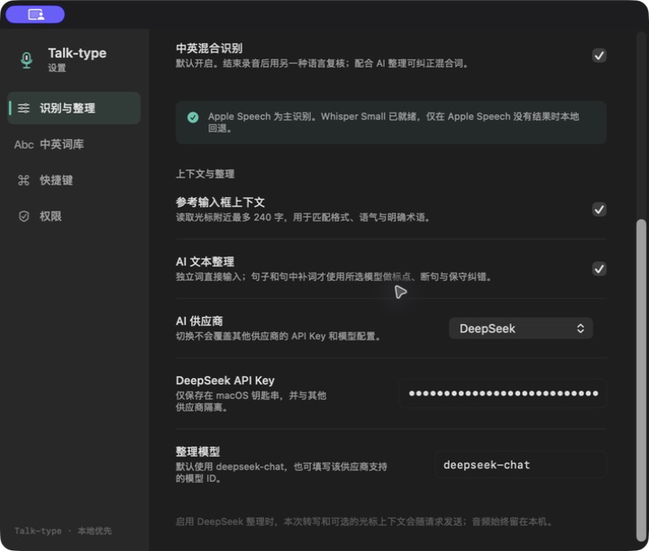

<div align="center">


# Talk-type

**macOS 语音输入工具**


[中文](#zh) · [English](#en)

</div>

<a id="zh"></a>

## Talk-type

Talk-type 面向 macOS 的中文、英文和中英混合语音输入。可在设置中切换中文或 English 作为主要识别语言，中英混合识别默认开启。它将实时语音识别、文本整理和跨应用输入整合在一起，适合写作、聊天、笔记和日常办公。

<p align="center">
  
</p>

<p align="center">
  
</p>

<p align="center">
  
</p>

<p align="center">
  
</p>

### 功能

- **实时识别与纠错**：录音时实时显示转写内容；开启 AI 整理后，文本会在录音期间同步更新，结束后可看到识别、整理和写入状态。
- **中文、英文与中英混合输入**：可在设置中切换中文或英文作为主要识别语言；中英混合识别默认开启，以另一种语言辅助复核。
- **本地 Whisper 回退**：Apple Speech 无结果时，可使用本机 Whisper Small 继续识别。
- **多 AI 整理**：支持 DeepSeek、Anthropic（Claude）、OpenAI、xAI（Grok）、Qwen（通义千问）和 Kimi（月之暗面）。
- **上下文整理**：结合光标附近文本处理标点、断句、空格和句中插入。
- **跨应用输入**：通过 macOS 辅助功能写入当前输入框；不支持时保留到剪贴板。
- **全局快捷键与历史记录**：支持 `fn` 和自定义快捷键，最近输入保存在本机。

### 配置

首次使用时，在「设置 → 权限」中开启麦克风、语音识别和辅助功能权限。在「设置 → 识别与整理」中选择中文或 English 作为输入语言；中英混合识别默认开启。AI 整理为可选功能，可在同一页面选择服务、填写 API Key 和模型 ID；不同服务的配置独立保存。

### 技术实现

- **原生 macOS**：使用 SwiftUI 构建界面，结合 AppKit 处理菜单栏、窗口、全局快捷键和跨应用输入。
- **实时识别链路**：`AVAudioEngine` 同时采集麦克风、保存临时音频并输出音量数据；Apple Speech 提供录音过程中的实时结果。
- **本地回退识别**：Apple Speech 没有得到有效结果时，调用本机 `whisper-cli` 和 Whisper Small 模型继续识别，音频文件只作为本次处理的临时文件。
- **双语识别**：主语言可以选择中文或 English；混合模式默认开启，录音时显示主语言结果，结束后使用另一种语言复核，中英文内容交给整理流程保守合并。
- **多服务适配**：统一 AI 文本整理接口，分别适配 Chat Completions 和 Anthropic Messages API；每个服务独立保存 API Key 和模型 ID。
- **跨应用写入**：通过 macOS Accessibility 读取有限的光标上下文并写入当前输入框；无法自动写入时保留到剪贴板。API Key 使用 macOS 钥匙串保存。

### 安装

当前暂未提供 DMG 安装包，可从源码运行：

```bash
git clone https://github.com/cyx2333hhh/talk-type.git
cd talk-type
open Murmur.xcodeproj
```

需要 macOS 14 或更高版本和 Xcode。使用本地 Whisper 回退时，请自行安装 `whisper-cli` 和 Whisper Small 模型。

### 致谢

Talk-type 使用 Apple Speech、AVFoundation 和 [whisper.cpp](https://github.com/ggerganov/whisper.cpp)。项目开发过程中使用了 **OpenAI Codex** 协作完成方案讨论、实现与验证。

### 许可证

[MIT License](LICENSE)

---

<a id="en"></a>

## About Talk-type

Talk-type is a macOS voice input tool for Chinese, English, and mixed Chinese-English input. Choose Chinese or English as the primary recognition language in Settings; mixed Chinese-English recognition is enabled by default. It brings live speech recognition, text cleanup, and cross-app input together for writing, messaging, note-taking, and everyday work.

<p align="center">
  
</p>

<p align="center">
  
</p>

<p align="center">
  
</p>

<p align="center">
  
</p>

### Features

- **Live recognition and cleanup**: Shows the live transcript while recording. With AI cleanup enabled, the text updates during recording and the app shows recognition, cleanup, and insertion status after recording ends.
- **Chinese, English, and mixed input**: Choose Chinese or English as the primary recognition language. Mixed Chinese-English recognition is on by default and uses the other language as a second pass.
- **Local Whisper fallback**: Uses local Whisper Small when Apple Speech returns no result.
- **Multiple AI providers**: Supports DeepSeek, Anthropic (Claude), OpenAI, xAI (Grok), Qwen, and Kimi (Moonshot).
- **Context-aware cleanup**: Uses nearby cursor text to handle punctuation, sentence breaks, spacing, and inline insertion.
- **Cross-app input**: Writes into the focused field through macOS Accessibility, or keeps the text on the clipboard when unavailable.
- **Global shortcuts and local history**: Supports `fn` and custom shortcuts; recent input stays on the Mac.

### Setup

On first use, grant Microphone, Speech Recognition, and Accessibility permissions in **Settings → Permissions**. In **Settings → Recognition & Cleanup**, choose Chinese or English as the input language; mixed Chinese-English recognition is enabled by default. AI cleanup is optional. On the same page, choose a provider and enter its API key and model ID; settings are stored separately for each provider.

### Technical notes

- **Native macOS**: The interface is built with SwiftUI, with AppKit handling the menu bar, windows, global shortcuts, and cross-application input.
- **Live recognition pipeline**: `AVAudioEngine` captures the microphone, writes temporary audio, and emits level data; Apple Speech supplies partial results while recording.
- **Local fallback**: If Apple Speech returns no usable result, the app calls local `whisper-cli` with the Whisper Small model. The audio file is temporary and used only for the current dictation.
- **Bilingual recognition**: Choose Chinese or English as the primary language. Mixed recognition is enabled by default: the primary result is shown live, then the other language is used as a second pass before conservative cleanup.
- **Provider adapters**: A unified cleanup client supports both Chat Completions and the Anthropic Messages API, while keeping API keys and model IDs separate for each provider.
- **Cross-app insertion**: macOS Accessibility supplies limited cursor context and writes into the focused field; the clipboard is used when automatic insertion is unavailable. API keys are stored in the macOS Keychain.

### Installation

There is no DMG release yet. Run from source instead:

```bash
git clone https://github.com/cyx2333hhh/talk-type.git
cd talk-type
open Murmur.xcodeproj
```

macOS 14 or later and Xcode are required. For local fallback transcription, install `whisper-cli` and the Whisper Small model.

### Credits

Talk-type uses Apple Speech, AVFoundation, and [whisper.cpp](https://github.com/ggerganov/whisper.cpp). **OpenAI Codex** was used during development for planning, implementation, and verification.

### License

[MIT License](LICENSE)
